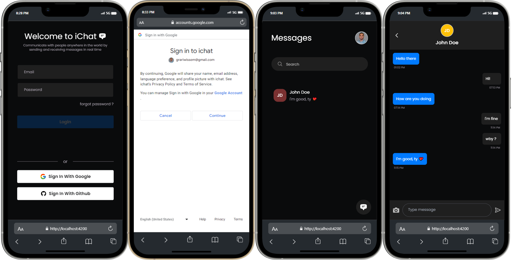

# iChat

Full‑stack real‑time chat app built with Angular (frontend) and Spring Boot (backend). Uses PostgreSQL, Flyway migrations, JWT auth with optional Google OAuth, and STOMP over WebSocket for live messaging.

## Screenshots


- Frontend: Angular 16, RxJS, TailwindCSS, ngx-toastr, SockJS + @stomp/rx-stomp
- Backend: Spring Boot 3.1, Spring Security, JPA/Hibernate, WebSocket/STOMP, Flyway, JJWT
- Database: PostgreSQL

Repository structure
- api/ — Spring Boot backend
- client/ — Angular frontend

Prerequisites
- Java 20
- Maven (mvnw.cmd included)
- Node.js 18+ and npm
- PostgreSQL 13+
- Optional: Google OAuth 2.0 Client (for Google login)

Configuration
Backend (api/src/main/resources/application.yml):
- Server port: 5000
- DB URL: jdbc:postgresql://localhost:5432/chat
- JPA DDL: validate (Flyway handles schema)
- WebSocket endpoint: /ws, allowed origin http://localhost:4200
- STOMP: application prefix /app, broker prefix /chat

Environment variables (backend reads from OS or api/.env via spring-dotenv):
- POSTGRES_USERNAME — database username
- POSTGRES_PASSWORD — database password
- JWT_SECRET_KEY — secret for JWT signing
- GOOGLE_CLIENT_ID — optional, for Google OAuth
- GOOGLE_CLIENT_SECRET — optional, for Google OAuth

Frontend API base (client/environment.ts):
- apiUrl: http://localhost:5000/api/v1

Quick start
1) Create the database
- Create a PostgreSQL database named chat.
- Ensure the user in POSTGRES_USERNAME has access.

2) Set backend env vars (Windows PowerShell)
```powershell
cd api
Copy-Item .env.example .env
# Or set inline for the session
$env:POSTGRES_USERNAME="postgres"
$env:POSTGRES_PASSWORD="postgres"
$env:JWT_SECRET_KEY="change-me"
# Optional
$env:GOOGLE_CLIENT_ID="your-client-id"
$env:GOOGLE_CLIENT_SECRET="your-client-secret"
```
macOS/Linux equivalents use: export VAR=value

3) Install frontend deps
```bash
cd client
npm install
```

Run (development)
Backend (port 5000):
- Windows
```powershell
cd api
.\mvnw.cmd spring-boot:run
```
- macOS/Linux
```bash
cd api
./mvnw spring-boot:run
```

Frontend (port 4200):
```bash
cd client
npm start
```
Open http://localhost:4200

Build
Backend JAR:
- Windows: `cd api && .\mvnw.cmd clean package`
- macOS/Linux: `cd api && ./mvnw clean package`

Frontend production build:
- `cd client && npm run build`

Testing
Backend tests:
- Windows: `cd api && .\mvnw.cmd test`
- macOS/Linux: `cd api && ./mvnw test`

Frontend tests (Karma):
- `cd client && npm test`

Real‑time messaging (STOMP)
- Connect to: ws://localhost:5000/ws (SockJS supported)
- Send to: /app/... destinations
- Subscribe to: /chat/... topics

Troubleshooting
- Port conflicts: 5000 (backend) or 4200 (frontend) already in use — stop the other process or change the port.
- Database connection: verify chat DB exists, credentials match, PostgreSQL listens on 5432.
- Flyway errors: check api/src/main/resources/db/migration order; for dev, recreate the DB if needed.
- CORS/WebSocket blocked: use http://localhost:4200 and ensure backend allows this origin.
- 401/403: set JWT_SECRET_KEY and cookies/tokens; configure Google OAuth vars if using Google login.

Notes
- The repo includes api/.env.example — copy to api/.env and edit values.
- Frontend’s WebSocket URL is configured in client/src/app/rx/my-rx-stomp.config.ts.

